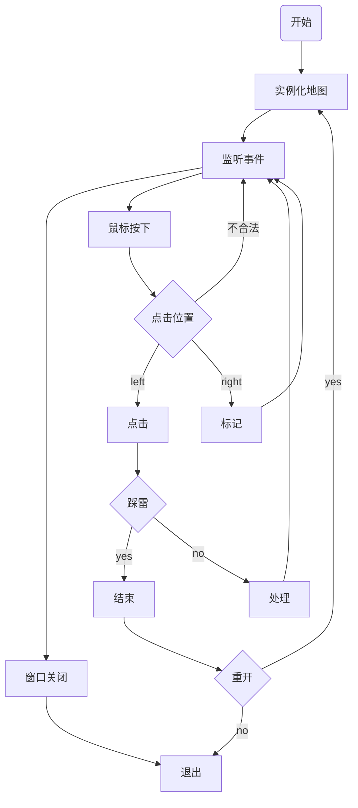

> 2025/5/1 12:17:55

##### 环境

qt安装：5.15之前下载离线安装，5.15之后下载在线安装器（选择自定义安装，选则archive,选择对应版本安装）

```bash
.\qt-unified-windows-x64-4.6.0-online.exe --mirror https://mirrors.ustc.edu.cn/qtproject
```

我这里选择安装5.15.0，选择msvc2019，与之配套的是vs2022。或者使用vs install安装对应的msvc版本

5.15版本会自动扫描配置msvc

qmake相当于cmake是用于生成makefile的。要添加一种编译器就要添加对应的套件

##### 常见的自动生成的信号和槽

| 控件         | 信号                           | 槽                       |
| ------------ | ------------------------------ | ------------------------ |
| QPushButton  | clicked、pressed、released     | `on_控件名_信号`         |
| QLabel       | linkActivated                  | setText                  |
| QLineEdit    | textChanged、editingFinished   | setText、clear           |
| QComboBox    | currentIndexChanged、activated | setCurrentIndex、addItem |
| QCheckBox    | toggled                        | setChecked、isChecked    |
| QRadioButton | toggled                        | setChecked、isChecked    |
| QSlider      | valueChanged                   | setValue、setRange       |
| QSpinBox     | valueChanged                   | setValue、setRange       |
| 列表         | clicked                        | addItem、setCurrentRow   |

**`QAction`** 通常与**`QMenu`** 或 **`QToolBar`** 中的菜单项或按钮绑定。信号为triggered

##### 扫雷流程图



##### 要点

* 全局只有唯一一份，故设计为单例模式
* 随机算法，注意判断边界，如果确定此位置布雷（我用-1表示），其周围8个方向的数据均加1；
* 每个格子元素一个位图使用QGraphicsPixmapItem、QGraphicsScene用来存放整个地图、QGraphicsView把 Scene 的内容渲染到屏幕上
* 点击的格子周围没有地雷，需要自动扩展
* 探寻周围8个方向的格子元素（底层数据）是否周围没有地雷，如果是的话就将其加入队列，不是的话翻开；需要加上标记表示其是否被翻开过，如果已经被访问过就不需要再加进队列了；
* 鼠标位置转地图位置

> 2025/5/1 22:51:29

在之前安装qt的目录下找到MaintenanceTool.exe进行补安装cdb调试

二维数组里面，当前位置的数字大小就表示周围雷的数量

QGraphicsView的itemat(x,y)用于鼠标位置转为对应item\

点击位置为0，自动扩展将周围不是-1的全显示出来，还有0则继续扩展

> 2025/5/2 10:53:21

ubuntu24安装qt 。在windows中下载好qt在线安装程序.run，拖到虚拟机

24无法拖文件sudo gedit /etc/gdm3/custom.conf取消WaylandEnable=false注释然后sudo systemctl restart gdm3即可拖

sudo apt install nautilus-extension-gnome-terminal后在文件夹中右键有在次打开终端

chmod给run文件添加可执行权限，然后./xx.run执行选择版本安装

sudo apt install libxcb-cursor0安装qtcreator依赖

安装gcc/g++/make

创建qtcreator桌面快捷方式,桌面上创建一个xx.desktop文件

```desktop
[Desktop Entry]
Type=Application
Name=qtcreator
Exec=/home/xiaoyu/Qt/Tools/QtCreator/bin/qtcreator
Terminal=false
StartupNotify=true
```

然后右键选择允许执行

##### ubuntu突然不能复制粘贴

sudo apt-get remove --auto-remove open-vm-tools

sudo apt-get remove --auto-remove open-vm-tools-desktop

然后重新安装，然后重启

##### 构建报错

:-1: error: cannot find -lGL: No such file or directory：解决sudo apt install libgl1-mesa-dev

### 演示


